# SSACURITY STM32 Drive Controller


<p align="center">
  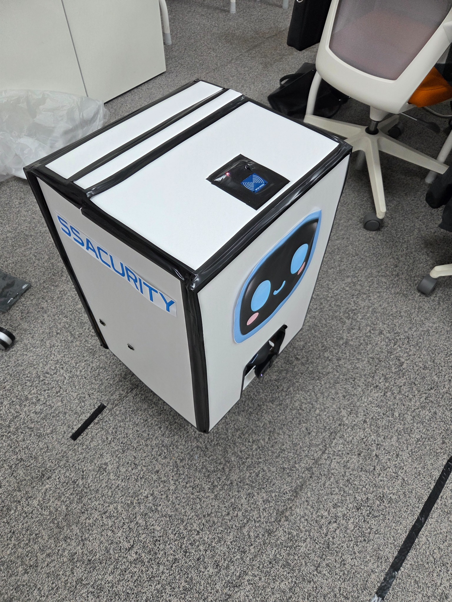
</p>

SSACURITY 보안로봇의 STM32 주행 제어 펌웨어이다.

Jetson에서 목표 속도와 조향각을 보내면 STM32가 모터, 조향, 초음파 안전정지, 오도메트리, 통신 상태를 처리한다.  
이 README는 전체 프로젝트 중 STM32 쪽만 정리했다.

<!-- 구동 영상 업로드 후 추가
## Demo

[](https://www.youtube.com/watch?v=VIDEO_ID)
-->

---

## 기능

- FreeRTOS 기반 주행 제어
- 엔코더 기반 DC 모터 속도 제어
- 실측값 기반 조향 LUT
- Jetson ↔ STM32 UART 통신
- 통신 끊김 Watchdog / Neutral Rearm
- HC-SR04 기반 전방 안전정지
- BNO085 + 엔코더 오도메트리

### 결과 요약

| 항목 | 결과 |
| --- | --- |
| 속도 측정 | 100 / 150 / 250 mm/s 구간 STD **71.8 / 71.6 / 61.7% 감소** |
| Feedforward | 250 mm/s 추종률 **88.1% → 98.2%** |
| Feedforward | 250 mm/s MAE **29.86 → 7.16 mm/s** |
| Anti-windup | 포화 해제 후 MAE **59.9% 감소** |
| Heading | MODEL_ONLY **8.19°** → IMU_ONLY **1.32° MAE** |
| 직선거리 | 1 m 3회 평균 **1018 mm**, 평균 절대오차 **1.8%** |

---

## 전체 구조

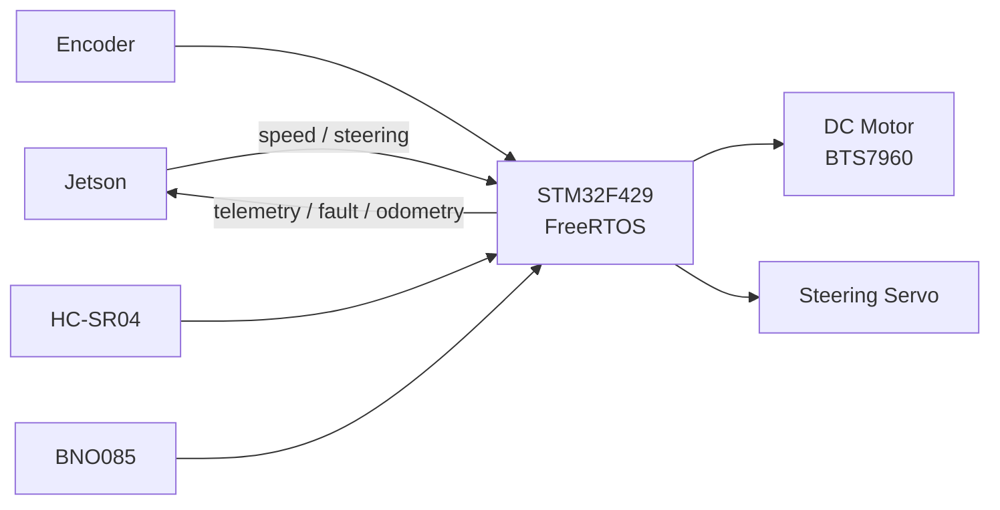

Jetson은 목표값을 보내고, 실제 출력과 안전 처리는 STM32에서 한다.  
통신이 끊기거나 전방에 장애물이 잡혀도 STM32 쪽에서 모터를 끌 수 있게 했다.

---

## FreeRTOS

기능별로 Task를 나눴다.

| Task | 실행 | Priority | 역할 |
| --- | --- | --- | --- |
| `SafetyTask` | 10 ms | High | 초음파 상태 판단 |
| `ControlTask` | 10 ms | AboveNormal | 속도/조향 제어, 출력 |
| `ImuTask` | DRDY event | AboveNormal | BNO085 데이터 처리 |
| `OdometryTask` | 20 ms | Normal | 위치/Heading 계산 |
| `CommTask` | 반복 실행 | Normal | UART, Watchdog, Telemetry |
| `UltrasonicTask` | 60 ms | Normal | 거리 측정, Median Filter |

Control과 Safety는 10 ms 주기로 돌리고, IMU는 Polling 대신 DRDY 인터럽트가 들어왔을 때 처리한다.  
Odometry와 초음파는 제어주기와 분리했다.

고정주기 Task는 `osDelayUntil()`을 사용했다. ISR에서는 계산을 길게 하지 않고 필요한 이벤트나 측정값만 넘긴다.

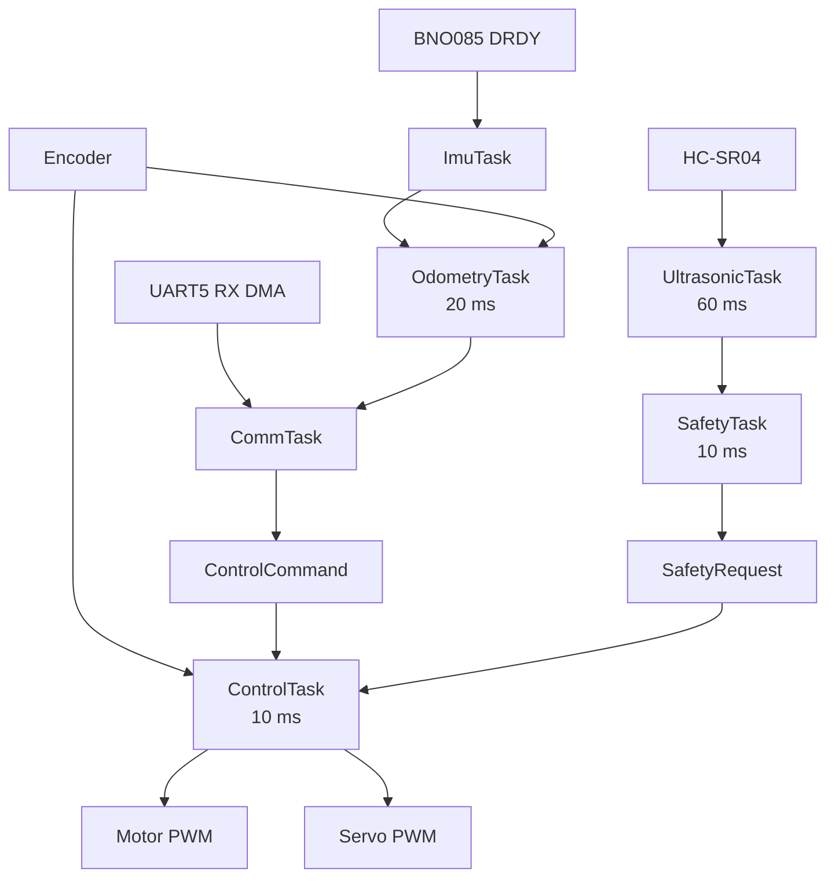

---

## 모터 속도 제어

속도 제어는 처음부터 한 번에 맞춘 게 아니라, 실차에서 문제가 보일 때마다 순서대로 손봤다.

### 10 ms 제어 / 50 ms 속도 측정

엔코더는 `823 count/rev`, 바퀴 둘레는 약 `0.20106 m`이다.

10 ms마다 바로 속도를 계산하면 1 count 차이가 약 `24.43 mm/s`로 잡혀 저속에서 측정값이 많이 흔들렸다.

제어주기를 50 ms로 늦추는 대신, **제어는 10 ms 그대로 두고 속도 측정만 최근 5개 샘플을 사용**했다.

```text
Control / PI          = 10 ms
Speed measurement     = 50 ms

1 count @ 10 ms ≈ 24.43 mm/s
1 count @ 50 ms ≈  4.89 mm/s
```

<p align="center">
  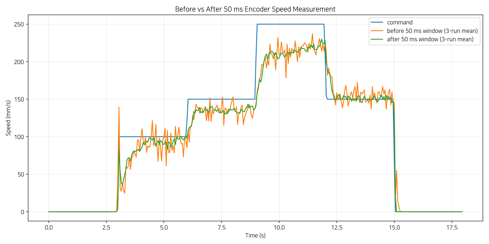
</p>

| Target | Before STD | After STD | 감소 |
| ---: | ---: | ---: | ---: |
| 100 mm/s | 26.33 | 7.43 | **71.8%** |
| 150 mm/s | 23.84 | 6.77 | **71.6%** |
| 250 mm/s | 18.68 | 7.16 | **61.7%** |

제어주기는 그대로라서 반응주기를 늦춘 건 아니다. 엔코더 속도 계산 구간만 넓혔다.

### Feedforward

50 ms 적용 후에는 속도값 흔들림은 줄었지만, 250 mm/s에서 목표속도보다 계속 낮게 나왔다.

실차에서 측정한 속도와 Duty 관계를 선형회귀해서 기본 Duty를 만들고, PI는 그 위에서 오차만 보정하게 바꿨다.

```text
측정값 회귀:
duty[%] ≈ 18.57 + 46.02 × speed[m/s]    (R² = 0.987)

적용값:
Feedforward[%] = 18.5 + 46.5 × |target_speed[m/s]|
```

현재 Gain은 아래와 같다.

```text
Kp = 120
Ki = 20
Kd = 0
dt = 0.010 s
```

`Kd=0`이라 실제 동작은 PI이다.

<p align="center">
  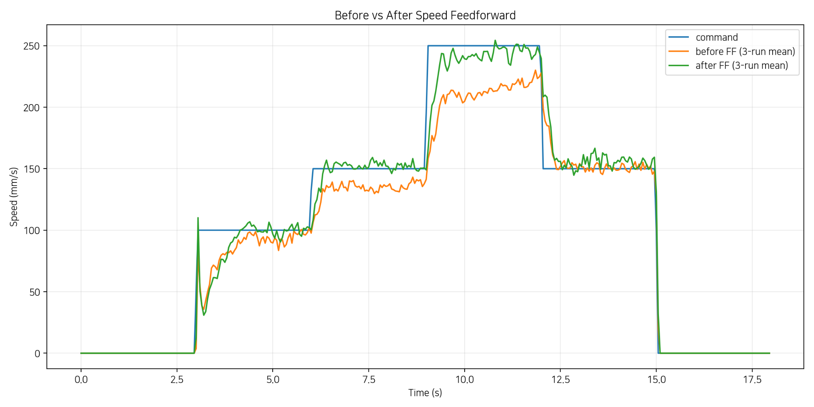
</p>

250 mm/s 구간에서 3회 평균 기준:

- 추종률: **88.1% → 98.2%**
- MAE: **29.86 → 7.16 mm/s**
- MAE 감소: **76.0%**

### Anti-windup

출력이 포화된 상태에서 오차가 계속 크면 적분값이 쌓여서, 이후 목표속도를 낮춰도 복귀가 늦어질 수 있다.

`1500 → 100 mm/s`로 목표를 바꿔 포화를 만든 뒤 Anti-windup ON/OFF를 각각 3회 비교했다.

현재는 Conditional Integration을 사용한다.

- 포화가 아니면 적분
- 포화 상태라도 오차가 포화를 푸는 방향이면 적분
- 반대 방향이면 Integral 유지

<p align="center">
  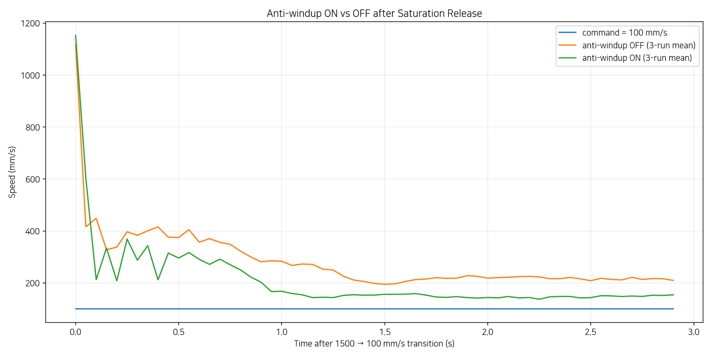
</p>

100 mm/s 구간 마지막 1초 MAE:

```text
OFF : 117.06 mm/s
ON  :  46.90 mm/s

59.9% 감소
```

---

## 조향

조향각 센서를 달 계획이었지만, 최종 조립 상태에서는 센서와 자석을 넣을 공간이 나오지 않았다.

그래서 단순히 Servo PWM을 각도로 비례 변환하지 않고, 실제 바퀴를 놓고 Pulse 7점에서 좌·우 조향각을 직접 쟀다.

<p align="center">
  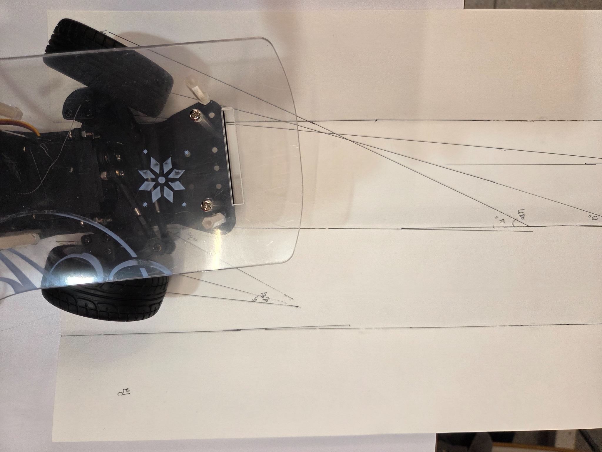
</p>

| Pulse | Left | Right |
| ---: | ---: | ---: |
| 750 us | +15° | +22° |
| 905 us | +10° | +17° |
| 1060 us | +8° | +12° |
| 1215 us | 0° | 0° |
| 1370 us | -8° | -6° |
| 1525 us | -17° | -18° |
| 1680 us | -29° | -26° |

좌우 바퀴각이 같지 않아서 단순 평균은 쓰지 않았다.  
각 바퀴의 곡률을 계산한 뒤 차량 중심 기준 등가 조향각으로 바꿔 LUT를 만들었다.

차량 치수는 `L=0.135 m`, `T=0.085 m`를 사용했다.

최종 조립 후 직진점이 `1215 us`에서 `1231 us`로 바뀌어서 LUT 전체에 `+16 us` trim을 적용했다.

<p align="center">
  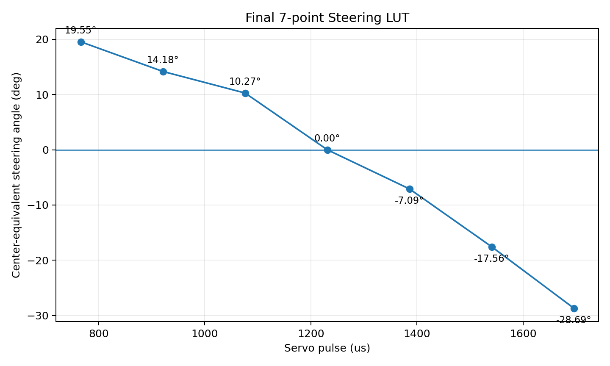
</p>

| Equivalent angle | Servo pulse |
| ---: | ---: |
| +19.55° | 766 us |
| +14.18° | 921 us |
| +10.27° | 1076 us |
| 0.00° | **1231 us** |
| -7.09° | 1386 us |
| -17.56° | 1541 us |
| -28.69° | 1696 us |

중간값은 구간별 선형보간으로 계산한다.

현재 조향은 실제 각도 Feedback이 없는 **보정된 Open-loop 방식**이다.

---

## Jetson ↔ STM32 통신

UART5를 사용하고, 문자열 대신 Binary Frame으로 통신한다.

```text
[AA][55][02][MSG_ID][SEQ][LEN][PAYLOAD][CRC_L][CRC_H]
```

주행 중에는 Command와 Telemetry가 계속 오가기 때문에 Frame 경계, CRC, 중복 Command, 통신 끊김을 따로 처리했다.

| 처리 | 방식 |
| --- | --- |
| Frame 경계 | SOF + LEN |
| 데이터 손상 | CRC-16/CCITT-FALSE |
| 중복/과거 Command | 8-bit SEQ |
| RX | 256 B Circular DMA |
| Buffer | 512 B Software Ring |
| Stream parsing | Persistent Parser |
| 불완전 Frame | 100 ms timeout |
| Drive Command 끊김 | 300 ms Watchdog |
| 통신 복구 후 재출발 방지 | Neutral Rearm |

```text
UART5 RX
↓
Circular DMA
↓
Software Ring
↓
Parser
↓
LEN / CRC / SEQ 확인
↓
Command Validation
↓
ControlCommand
```

주요 Message ID:

| ID | Message |
| ---: | --- |
| `0x10` | `CMD_DRIVE` |
| `0x11` | `CMD_STOP` |
| `0x12` | `CMD_RESET_FAULT` |
| `0x80` | `TELEMETRY_DRIVE` |
| `0x81` | `FAULT_EVENT` |
| `0x82` | `COMMAND_RESULT` |
| `0x83` | `TELEMETRY_IMU` |
| `0x84` | `TELEMETRY_RANGE` |
| `0x85` | `TELEMETRY_ODOMETRY` |

Watchdog은 UART Byte 수신 여부가 아니라 **정상적으로 수락된 새 `CMD_DRIVE`**를 기준으로 갱신한다.

300 ms 동안 새 Drive Command가 없으면:

```text
COMM_TIMEOUT
→ SAFE_STOP
→ Neutral Rearm 필요
```

통신이 다시 붙었다고 바로 움직이지 않고, Neutral `CMD_DRIVE(0, 0, 0)`을 한 번 받은 뒤 다음 주행명령을 받도록 했다.

`300 ms`는 통신 끊김을 감지하는 시간이지 차량의 물리적 정지시간은 아니다.

UART5 실제 연결에서 Echo를 확인했고, CRC 오류, 잘린 Frame, 잘못된 LEN, duplicate/old SEQ, 범위 밖 속도/조향 명령도 따로 넣어 확인했다.

---

## 초음파 안전정지

전방 HC-SR04는 거리 Telemetry만 보내는 용도가 아니라 STM32에서 바로 모터를 멈추는 Local Safety에 사용한다.

Echo는 TIM2 Input Capture로 받고, ISR에서는 Pulse Width만 확보한다. 실제 거리 계산과 Filter는 `UltrasonicTask`에서 한다.

```text
TRIG              = 10 us
Measurement period= 60 ms
Echo timeout      = 30 ms
Valid range       = 0.03 ~ 4.00 m
Filter            = 3-sample Median
Sensor stale      = 200 ms
```

단일 측정값에 바로 반응하지 않도록 Median Filter를 넣었고, STOP 경계에서 상태가 계속 바뀌지 않도록 진입/해제 거리를 다르게 잡았다.

| 상태 | 조건 |
| --- | --- |
| CAUTION | `< 0.60 m` |
| CAUTION 해제 | `>= 0.65 m` |
| STOP | `< 0.40 m` |
| STOP 해제 후보 | `>= 0.50 m` |
| 실제 해제 | `0.50 m 이상 정상 Sample 3회 연속` |

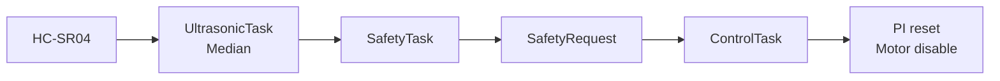

Timeout, Out-of-range, Stale 상태도 안전 측으로 처리한다.

물리 E-stop이나 별도 Motor Power Cutoff 회로까지 구현한 것은 아니다.

---

## Odometry / BNO085

이동거리는 엔코더, Heading은 BNO085를 사용한다.

```text
Distance → Encoder
Heading  → BNO085 Game Rotation Vector

IMU invalid / stale
→ Steering LUT + Bicycle Model fallback
```

처음에는 조향 LUT와 엔코더 거리로 Bicycle Model Heading을 계산했다.

90° 좌·우 회전 시험에서 `MODEL_ONLY` MAE가 8.19°였고, BNO085 Heading을 사용했을 때는 1.32°였다. Model과 IMU를 섞은 0.75 Fusion도 같이 비교했지만 1.65°로 IMU 단독보다 좋지 않았다.

<p align="center">
  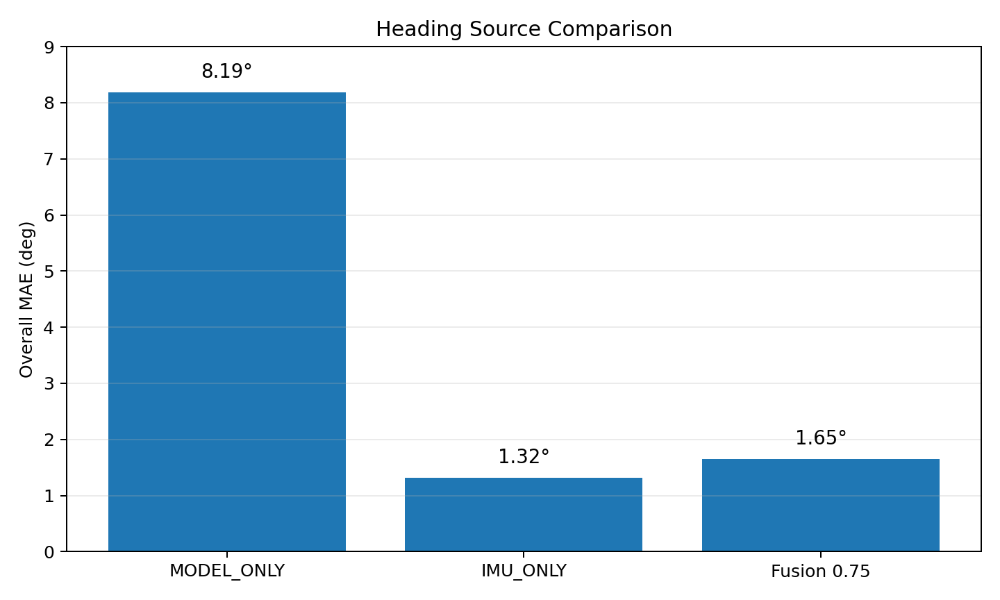
</p>

| Heading source | MAE |
| --- | ---: |
| `MODEL_ONLY` | **8.19°** |
| `IMU_ONLY` | **1.32°** |
| Fusion `0.75` | **1.65°** |

IMU_ONLY의 좌/우 MAE는 각각 `1.23°`, `1.41°`였다.

그래서 최종 기본 Heading Source는 `IMU_ONLY`로 두고, IMU 데이터가 유효하지 않을 때만 Model로 fallback한다.

여기서 `IMU_ONLY`는 Heading만 IMU를 쓴다는 뜻이다. 이동거리는 계속 엔코더로 계산한다.

### 직선거리 확인

<p align="center">
  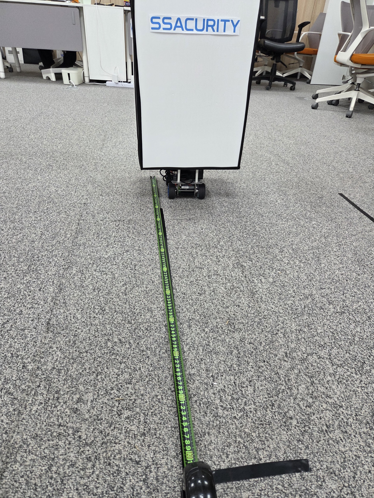
</p>

1 m 직선주행 3회 결과:

```text
1015 mm
1021 mm
1018 mm

평균 1018 mm
평균 절대오차 1.8%
```

이 값은 1 m 직선 누적거리 결과이고, 전체 2D Odometry 정확도를 뜻하지는 않는다.

---

## 검증

| 항목 | 확인 방법 |
| --- | --- |
| 속도 측정 | 50 ms 적용 전/후 동일 Staircase 3회 |
| Feedforward | 적용 전/후 동일 Profile 3회 |
| Anti-windup | 1500 → 100 mm/s ON/OFF 각 3회 |
| 조향 | Servo Pulse 7점에서 좌/우 바퀴각 실측 |
| UART | Echo, CRC/LEN/SEQ/범위 오류 주입 |
| Watchdog | 300 ms timeout → SAFE_STOP → Neutral Rearm |
| 초음파 | 장애물 진입 시 Motor Disable 확인 |
| 거리 | 1 m 직선 3회 |
| Heading | 좌/우 약 90° MODEL / IMU / Fusion 비교 |

---

## Hardware

<p align="center">
  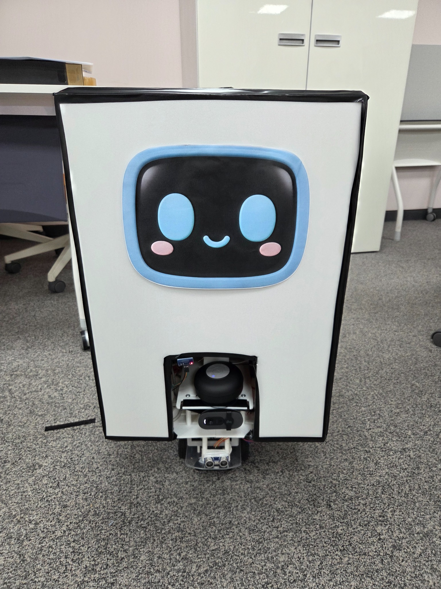
</p>

| 부품 | 용도 |
| --- | --- |
| STM32F429I-DISC1 | 주행 제어 |
| BTS7960 | DC 모터 드라이버 |
| DC Motor + Encoder | 구동 / 속도 측정 |
| MG996R | 조향 Servo |
| BNO085 | Heading |
| HC-SR04 | 전방 거리 측정 |

주요 연결:

| 기능 | STM32 | Peripheral |
| --- | --- | --- |
| Jetson 통신 | PC12 / PD2 | UART5 TX / RX |
| Motor PWM | PA0 / PA3 | TIM5, 20 kHz |
| Encoder | PB6 / PB7 | TIM4 Encoder Mode |
| Steering PWM | PB4 | TIM3, 50 Hz |
| Ultrasonic ECHO | PB3 | TIM2 Input Capture |
| BNO085 | PF6~PF9, PG2~PG3 | SPI5 / GPIO / EXTI |

전체 배선은 [`docs/final_vehicle_wiring.md`](docs/final_vehicle_wiring.md)에 정리했다.

---

## Repository

```text
App/
├─ Inc/
└─ Src/
   ├─ app_freertos.c
   ├─ task_control.c
   ├─ task_safety.c
   ├─ task_ultrasonic.c
   ├─ task_imu.c
   ├─ task_odometry.c
   ├─ pid.c
   └─ safety.c

Core/
├─ Inc/
└─ Src/
   ├─ comm_protocol.c
   ├─ comm_service.c
   └─ uart_transport.c

Drivers/BSP/
├─ motor
├─ encoder
├─ steering
├─ ultrasonic
└─ bno085

tools/
└─ 테스트 / 진단 스크립트

docs/
└─ 배선 / 통신 / 구현 문서
```

---

## Build

필요 환경:

- STM32CubeIDE
- STM32CubeF4
- ST-LINK
- Python 3.10+ / `pyserial` (진단 스크립트)

```bash
git clone https://github.com/Jo-yongju/ssacurity.git
cd ssacurity
```

STM32CubeIDE에서 프로젝트를 Import한 뒤 Build / Flash하면 된다.

차량별 설정값은 `App/Inc/vehicle_config.h`에 모아뒀다.

---

## Limitations

- 조향각 Feedback Sensor가 없어 현재 조향은 LUT 기반 Open-loop 방식이다.
- 초음파 센서는 전방 1개만 사용한다.
- Encoder + IMU Odometry는 상대 위치 추정이다.
- 1 m 시험은 누적거리 검증이며 2D Trajectory Ground Truth 시험은 하지 않았다.
- RTOS의 WCET, Jitter, Stack High-water Mark는 별도로 정량 측정하지 않았다.
- CRC는 통신 오류 검출용이며 인증이나 암호화 기능은 없다.
- UART5는 3.3 V TTL이다.
- 물리 E-stop과 독립 Motor Power Cutoff는 구현하지 않았다.
