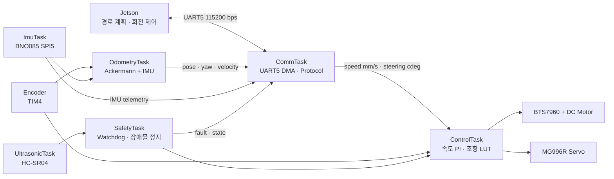

# SSACURITY STM32 Drive Controller


SSACURITY 자율주행 차량의 하위 주행 제어를 담당하는 STM32 펌웨어입니다.
Jetson이 목표 속도와 조향각을 전달하면 STM32가 모터·서보를 실시간 제어하고,
엔코더와 BNO085를 융합한 오도메트리 및 안전 상태를 다시 Jetson으로
전송합니다.

> 인터페이스 문서 버전은 **V3.0**, 실제 wire protocol의 `VERSION` 필드는
> **`0x02`**입니다.

## Project Status

| 영역 | 현재 상태 | 비고 |
| --- | --- | --- |
| Jetson 통신 | 구현 및 Echo 검증 | UART5, 115200 8-N-1, DMA RX/TX |
| 구동 모터 | 폐루프 속도 제어 구현 | 엔코더 피드백 PI 제어, 최대 95% PWM |
| 조향 서보 | 실차 7점 LUT 적용 | 직진 1231 us, 비대칭 좌·우 조향 범위 |
| IMU | BNO085 SPI5 연동 | gyro Z 기반 yaw 보정, g0 데이터 사용 허용 |
| 오도메트리 | 엔코더·아커만·IMU 융합 | `0x85` 텔레메트리 20 Hz |
| 초음파 안전 | 거리 텔레메트리 활성화 | 현재 로컬 정지는 시험상 일시 비활성화 |
| 90도 회전 | Jetson 제어 절차 정의 | 최종 실차 반복 오차 검증 진행 필요 |

현재 펌웨어는 시스템 연동 단계입니다. 기능 구현 완료와 실제 바닥·최종 하중
조건의 성능 검증 완료는 구분합니다.

## Key Features

- `CMD_DRIVE` 기반 목표 속도·조향 제어와 300 ms 통신 watchdog
- TIM4 quadrature encoder를 사용하는 100 Hz 속도 PI 제어
- MG996R 실측 7점 LUT 및 구간별 선형 보간
- BNO085 SHTP over SPI5 드라이버와 gyro Z 기반 yaw 보정
- 명령 조향각 기반 아커만 오도메트리와 IMU 가중 융합
- HC-SR04 입력 캡처, 3점 median filter, 선택형 로컬 장애물 정지
- UART DMA, ring buffer, CRC-16/CCITT-FALSE, 지속형 stream parser
- 상태·Fault·거리·IMU·오도메트리 텔레메트리
- 모터·엔코더·서보·오도메트리용 PC/Jetson 진단 도구

## System Architecture



Jetson은 경로와 행동을 결정하고, STM32는 주기 제어와 로컬 안전을 책임지는
구조입니다. IMU는 서보 PWM을 직접 바꾸지 않고 오도메트리의 yaw 변화량을
보정합니다.

## Hardware

### Main Components

| 부품 | 역할 |
| --- | --- |
| STM32F429I-DISC1 / STM32F429ZIT6 | 실시간 제어 및 센서 수집 |
| Jetson | 상위 경로 계획 및 주행 명령 생성 |
| BTS7960 | 12 V 구동 모터 H-bridge |
| DC motor + quadrature encoder | 차량 구동 및 속도 피드백 |
| MG996R | 아커만 조향 서보 |
| BNO085 | gyro·quaternion·linear acceleration |
| HC-SR04 | 전방 근접 장애물 감지 |

### Pin Map

| 기능 | STM32F429I-DISC1 | Peripheral | 연결 대상 |
| --- | --- | --- | --- |
| Jetson TX → STM RX | PD2 / P1-40 | UART5_RX / AF8 | Jetson TX |
| Jetson RX ← STM TX | PC12 / P1-43 | UART5_TX / AF8 | Jetson RX |
| Motor RPWM | PA0 / P2-18 | TIM5_CH1 / 20 kHz | BTS7960 RPWM |
| Motor LPWM | PA3 / P2-19 | TIM5_CH4 / 20 kHz | BTS7960 LPWM |
| Motor R_EN / L_EN | PE2 / PE3 | GPIO output | BTS7960 enable |
| Encoder A / B | PB6 / PB7 | TIM4_CH1 / CH2 | Quadrature encoder |
| Steering PWM | PB4 / P1-25 | TIM3_CH1 / 50 Hz | MG996R signal |
| Ultrasonic TRIG | PA5 / P2-21 | GPIO output | HC-SR04 TRIG |
| Ultrasonic ECHO | PB3 / P1-28 | TIM2_CH2 input capture | HC-SR04 ECHO |
| IMU SCK / MISO / MOSI | PF7 / PF8 / PF9 | SPI5 | BNO085 SCL / SDA / ADO |
| IMU CS / INT / RST | PF6 / PG3 / PG2 | GPIO / EXTI3 | BNO085 |
| Steering sensor reserve | PC3 / P2-15 | ADC1_IN13 | 현재 미연결 |

BNO085 모듈은 `VCC`, `PS1`, `PS0`를 3.3 V에 연결하고 모든 장치의 GND를
공통으로 묶습니다. Jetson 또는 USB-UART의 VCC는 STM32에 연결하지 않습니다.

전원 분배와 전체 배선은 [최종 차량 배선도](docs/final_vehicle_wiring.md)를
참조하십시오. 구동 모터와 서보 전원을 STM32 3.3 V 핀에서 공급하면 안 됩니다.

## Firmware Architecture

| Task | 주기/구동 방식 | 책임 |
| --- | ---: | --- |
| `ControlTask` | 10 ms | 엔코더 속도, PI 제어, 모터 PWM, 조향 LUT |
| `SafetyTask` | 10 ms | 초음파·제어 상태 평가, 출력 차단 요청 |
| `UltrasonicTask` | 60 ms | HC-SR04 측정 및 median filter |
| `OdometryTask` | 20 ms | 이동거리, pose, yaw, 곡률 계산 |
| `ImuTask` | INT 기반 | BNO085 report 수신 및 상태 관리 |
| `CommTask` | 1 ms | UART parser, 명령 적용, 텔레메트리 송신 |

주요 디렉터리는 다음과 같습니다.

```text
App/                FreeRTOS task, 제어·안전·오도메트리 로직
Core/               CubeMX 초기화, UART transport/protocol/service
Drivers/BSP/        Motor, encoder, ultrasonic, BNO085 드라이버
Middlewares/        FreeRTOS 및 CMSIS-RTOS2
tools/              PC/Jetson UART 진단 도구
docs/               배선, 프로토콜, 센서 및 트러블슈팅 문서
artifacts/          Jetson 팀 전달용 통합 자료
```

## Control and Odometry

### Drive Control

- 속도 명령 범위: `-1565 .. +1565 mm/s`
- 모터 출력 제한: `±95% PWM`
- 제어 주기: `100 Hz`
- 속도 제어기: `Kp=120`, `Ki=20`, `Kd=0`
- 명령이 300 ms 동안 갱신되지 않으면 PWM과 enable을 차단

### Steering

| 조향각 | PWM pulse |
| ---: | ---: |
| +19.55° | 766 us |
| +14.18° | 921 us |
| +10.27° | 1076 us |
| 0.00° | **1231 us** |
| -7.09° | 1386 us |
| -17.56° | 1541 us |
| -28.69° | 1696 us |

양수 조향은 좌회전/CCW, 음수 조향은 우회전/CW입니다. 조향센서가 아직
장착되지 않았으므로 오도메트리는 서보 명령에 대응하는 LUT 각도를 사용하며
`STEERING_ESTIMATED`를 표시합니다.

### IMU-fused Odometry

휠베이스 `0.135 m`, 전륜 조향 트랙 `0.085 m`의 아커만 모델로 회전량을
계산하고 BNO085 gyro Z 적분값을 다음과 같이 융합합니다.

```text
delta_yaw = 0.25 * ackermann_delta_yaw + 0.75 * imu_delta_yaw
```

차량 속도가 `0.02 m/s` 이상이고 IMU의 연결·gyro·freshness 조건을 만족할 때
융합합니다. 현재는 일정상 BNO085 accuracy gate를 비활성화하여 `g0`도
사용합니다. IMU가 끊기거나 stale이면 아커만 단독 적분으로 자동 복귀합니다.

## UART Protocol

```text
[AA][55][02][MSG_ID][SEQ][LEN][PAYLOAD 0..64][CRC_L][CRC_H]
```

- UART5 `115200 8-N-1`, 3.3 V TTL, flow control 없음
- Little-endian payload
- CRC-16/CCITT-FALSE
- 메시지 종류와 무관한 단일 8-bit TX sequence
- 350 ms 동안 유효 frame이 없으면 새 sequence session 허용
- RX DMA circular buffer + software ring, TX DMA queue

### Jetson → STM32

| ID | Message | Payload | 용도 |
| ---: | --- | ---: | --- |
| `0x10` | `CMD_DRIVE` | 5 B | 속도, 조향각, enable |
| `0x11` | `CMD_STOP` | 1 B | 즉시 안전정지 요청 |
| `0x12` | `CMD_RESET_FAULT` | 4 B | 확인한 fault 해제 요청 |
| `0xF0` | `DIAG_ECHO_REQUEST` | 0..31 B | UART 물리 경로 진단 |
| `0xF2` | `DIAG_MOTOR_TEST_REQUEST` | 4 B | 제한시간 모터 진단 |
| `0xF6` | `DIAG_SERVO_REQUEST` | 2 B | 원시 서보 pulse 진단 |

### STM32 → Jetson

| ID | Message | 주기/용도 |
| ---: | --- | --- |
| `0x80` | `TELEMETRY_DRIVE` | 20 Hz, 속도·PWM·조향·state |
| `0x81` | `FAULT_EVENT` | fault 변화 이벤트 |
| `0x82` | `COMMAND_RESULT` | STOP/RESET 및 진단 결과 |
| `0x83` | `TELEMETRY_IMU` | 20 Hz, gyro·accel·quaternion |
| `0x84` | `TELEMETRY_RANGE` | 10 Hz, 전방 초음파 거리 |
| `0x85` | `TELEMETRY_ODOMETRY` | 20 Hz, pose·yaw·속도·곡률 |

`CMD_DRIVE`는 개별 `COMMAND_RESULT`를 반환하지 않습니다. Jetson은
`TELEMETRY_DRIVE.last_drive_seq` 또는
`TELEMETRY_ODOMETRY.last_drive_seq`로 명령 수락 여부를 확인해야 합니다.

전체 byte layout과 fault bit 정의는
[Jetson–STM32 UART Interface V3](docs/jetson_stm32_uart_interface_v3.md)에
정리되어 있습니다.

## Safety Model

| 조건 | STM32 동작 |
| --- | --- |
| 유효한 `CMD_DRIVE`가 300 ms 없음 | `COMM_TIMEOUT`, neutral, `SAFE_STOP` |
| 초음파 거리·상태 | 현재 report-only, 거리 텔레메트리 유지 |
| 로컬 정지를 다시 `1U`로 활성화한 경우 | 0.20 m 미만 STOP, 0.30 m 이상 새 측정 3회 후 해제 |
| CRC/잘못된 명령/범위 초과 | 명령 거부 및 fault 보고 |
| 내부 제어·방향·stall fault | 출력 차단 또는 latched stop |

`SAFE_STOP` 이후에는 neutral `CMD_DRIVE(0,0,0)`을 보내고 `READY`를 확인한
다음 새 주행 명령을 보내는 흐름을 권장합니다.

현재 물리 E-stop 입력과 독립적인 모터 에너지 차단 회로는 확정되지 않았습니다.
UART `CMD_STOP`은 물리 E-stop을 대체하지 않습니다.

## Getting Started

### Requirements

- STM32CubeIDE
- STM32CubeF4 firmware package
- ST-LINK USB driver
- Python 3.10+ 및 `pyserial` — 호스트 진단 도구 사용 시
- 3.3 V USB-UART — PC에서 UART5 물리 경로를 시험할 때

### Clone and Build

```bash
git clone https://github.com/galahad0310/ssacurity-stm32-drive.git
cd ssacurity-stm32-drive
```

1. STM32CubeIDE에서 `Existing Projects into Workspace`로 저장소를 가져옵니다.
2. [vehicle_config.h](App/Inc/vehicle_config.h)의 현재 차량 설정을 확인합니다.
3. `Debug` configuration으로 Build합니다.
4. ST-LINK로 `Debug/ssacurity-stm32-drive.elf`를 플래시합니다.

CubeMX로 코드를 재생성한 경우 GPIO 초기 출력과 SPI5 공유 장치인 온보드
L3GD20의 CS 상태를 포함해 `git diff`를 반드시 검토하십시오.

### Active Communication Port

현재 브랜치는 최종 Jetson 연동을 위해 UART5를 활성화한 상태입니다.

```c
#define VEHICLE_COMM_USE_STLINK_VCP 0U
```

| 설정 | 통신 경로 | 사용 상황 |
| ---: | --- | --- |
| `0U` | UART5, PC12/PD2 | Jetson 또는 외부 USB-UART |
| `1U` | USART1, ST-LINK VCP | PC 벤치 시험 전용 |

PC의 ST-LINK VCP로 IMU 벤치 시험을 다시 수행할 때만 `1U`로 변경하고,
시험 후에는 `0U`로 복구하여 다시 빌드·플래시합니다.

## Verification

### Host-only Protocol Test

```bash
python3 -m pip install pyserial
python3 tools/uart_protocol_test.py self-test
python3 tools/jetson_uart_echo_test.py --self-test
```

### Jetson ↔ UART5 Echo

```bash
python3 tools/jetson_uart_echo_test.py \
  --port /dev/ttyUSB0 \
  --text JETSON
```

정상 결과:

```text
Jetson <-> STM32 UART5 echo: PASS
```

### Telemetry Monitor

```bash
python3 tools/uart_protocol_test.py telemetry-monitor \
  --port /dev/ttyUSB0 \
  --seconds 10
```

### BNO085 All-values Monitor

현재 PC 시험 펌웨어를 플래시한 뒤 ST-LINK COM 포트에서 실행합니다.

```powershell
py tools\uart_protocol_test.py imu-monitor `
  --port COM11 `
  --seconds 30 `
  --settle-seconds 3 `
  --rate-hz 2 `
  --csv imu_test.csv
```

이 명령은 모터·서보·주행 명령을 보내지 않고 roll/pitch/yaw, quaternion,
gyro XYZ, linear acceleration XYZ, accuracy와 IMU 상태를 출력합니다.

### Drive and Odometry Test

> 아래 시험은 반드시 구동 바퀴를 공중에 띄운 상태에서 수행하십시오.

```bash
python3 tools/uart_protocol_test.py drive-scenario \
  --port /dev/ttyUSB0 \
  --profile basic \
  --wheels-off-ground

python3 tools/uart_protocol_test.py odometry-test \
  --port /dev/ttyUSB0 \
  --wheels-off-ground
```

사용 가능한 모든 진단 명령은 다음 명령으로 확인할 수 있습니다.

```bash
python3 tools/uart_protocol_test.py --help
```

## Runtime Configuration

주요 실차 설정은 [vehicle_config.h](App/Inc/vehicle_config.h)에 모여 있습니다.

| 설정 | 현재 값 | 의미 |
| --- | ---: | --- |
| `VEHICLE_MAX_ABS_SPEED_MM_S` | `1565` | 속도 명령 절댓값 제한 |
| `VEHICLE_MIN_STEERING_CDEG` | `-2869` | 우측 조향 한계 |
| `VEHICLE_MAX_STEERING_CDEG` | `1955` | 좌측 조향 한계 |
| `VEHICLE_IMU_FUSION_WEIGHT` | `0.75` | yaw 변화량의 IMU 가중치 |
| `VEHICLE_IMU_ENFORCE_ACCURACY_GATE` | `0` | BNO085 g0 허용 |
| `VEHICLE_ENFORCE_ULTRASONIC_SAFETY` | `0` | 현재 로컬 정지 시험상 비활성화 |
| `VEHICLE_ALLOW_REVERSE_WITHOUT_REAR_SENSOR` | `1` | 후방 센서 없이 후진 허용 |
| `VEHICLE_COMM_USE_STLINK_VCP` | `0` | 현재 Jetson/UART5 통합 모드 |

## Documentation

| 문서 | 내용 |
| --- | --- |
| [최종 차량 배선도](docs/final_vehicle_wiring.md) | 전원, 공통 GND, 전체 핀 연결 |
| [Jetson–STM32 UART Interface V3](docs/jetson_stm32_uart_interface_v3.md) | frame, payload, state, fault 명세 |
| [BNO085 SPI5 Integration](docs/bno085_spi5_integration.md) | IMU 배선, 드라이버, 시험 절차 |
| [Ultrasonic Safety](docs/day3_ultrasonic_safety.md) | 거리 임계값 및 정지 시험 |
| [Jetson AI Implementation Prompt](docs/jetson_ai_implementation_prompt.md) | Jetson 구현 요구사항 |
| [Yaw 90° Handover](artifacts/jetson_yaw90_handover_2026-08-03/README.md) | 90도 회전 연동 자료 |
| [Troubleshooting](docs/troubleshooting/README.md) | 개발 과정과 고장 진단 기록 |

## Known Limitations

- 조향센서가 미장착 상태라 실제 바퀴각이 아닌 명령 기반 LUT를 사용합니다.
- BNO085가 `g0`을 보고해도 현재는 일정상 gyro 데이터를 융합합니다.
- 단일 전방 HC-SR04만 사용하며 후방·측면 장애물을 관측하지 않습니다.
- 초음파 로컬 정지는 현재 비활성화되어 있으므로 Jetson이 거리 텔레메트리를
  감시해 정지 명령을 내려야 합니다.
- HC-SR04의 `NO_ECHO`는 먼 거리와 ECHO 배선 이탈을 구분할 수 없습니다.
- 최종 하중·노면에서의 최고속도, 제동거리, 90도 회전 반복 오차는 추가 실차
  검증 대상입니다.
- 물리 E-stop 및 독립적인 모터 전원 차단 경로가 아직 없습니다.

## Final Hardware Checklist

- [ ] 모든 장치의 GND가 공통으로 연결되어 있는가
- [ ] Jetson TX/RX가 STM32 RX/TX와 교차 연결되어 있는가
- [ ] 모터·서보 전원이 STM32 논리 전원과 분리되어 있는가
- [ ] BNO085가 차체에 수평·강성 고정되어 있는가
- [ ] HC-SR04 정면에 차체 부품이나 배선이 걸리지 않는가
- [ ] 바퀴 공중 시험에서 watchdog과 장애물 STOP이 동작하는가
- [ ] 바닥 저속 시험에서 조향 부호와 yaw 부호가 일치하는가
- [ ] Jetson이 `last_drive_seq`, state, fault를 감시하는가
